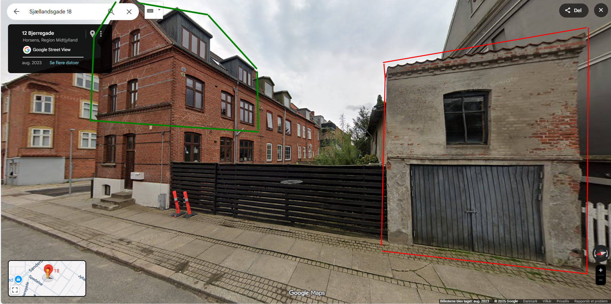
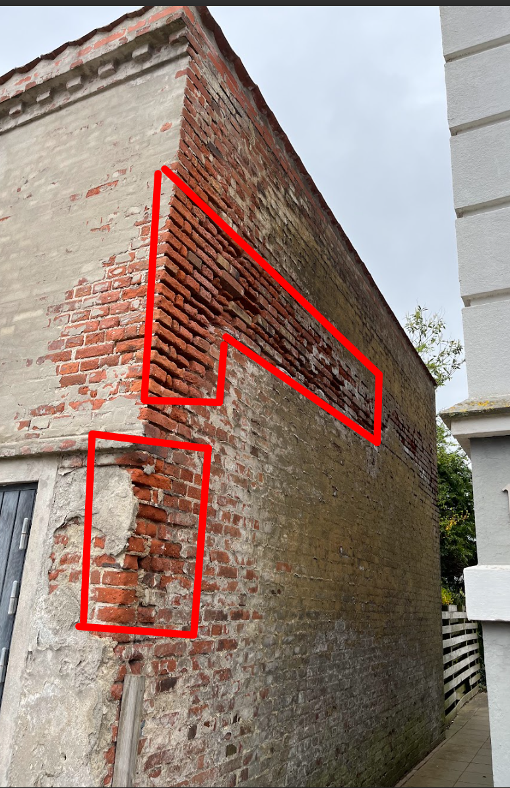

# 0. Reparation af murværk pÃ¥ skur
I dagene før 1. november vil vi gerne have repareret murværket på skuret. 

DET ER MEGET VIGTIGT AT VEJRET ER TØRT OG OVER 5 GRADER (OGSÅ OM NATTEN) - Derfor kan denne opgave måske blive nødt til at blive skudt.

Skuret er markeret i rødt nedenfor, mens lejligheden der skal renoveres er markeret i grøn. 

Set fra oven, er her skuret markeret i rødt igen og beboelsesejendommen markeret i grøn. Hver af siderne på muren er her defineret med #(1-4), og mur #1 er den man kan se fra vejen og første billede. 

### Dette skal laves
1. Løse mursten skal fæstnes
2. slidte / ødelagt mursten skal udskiftes
3. meget slidte fuger skal genetableres
4. algefjerner bruges på områder med alger efter fugerne er blevet renset.

### Områder af muren
Alle murene skal repareres hvor der mangler mørtel eller hvor murstenene er ødelagt. 
De værste områder er:
- #2

- hjørnet mellem #2 og #3 og #3

#3 er nok lidt besværligt at komme til pga. et hegn, men så må du gå ind fra den anden side.
- #4 burde se bedre mere tør ud end på dette billede
 

### Værktøj der skal bruges
1. mejsel
2. Murerske og fugejern 
3. stålbørste
4. murskehammer
5. murerspand
6. piskeris til blanding af mørtel
7. Skuremaskine til blanding af mørtel
8. vaterpas
9. kost 
10. vandforstøver
11. stige

### Materialer
1. kalkmørtel (færdigblandet tørmørtel - gerne vintermørtel)
2. mursten
3. vand
4. dækplast
5. Algefjerner (ph neutralt eller basisk! ikke syrebaseret - det ætser fuger og mursten)
