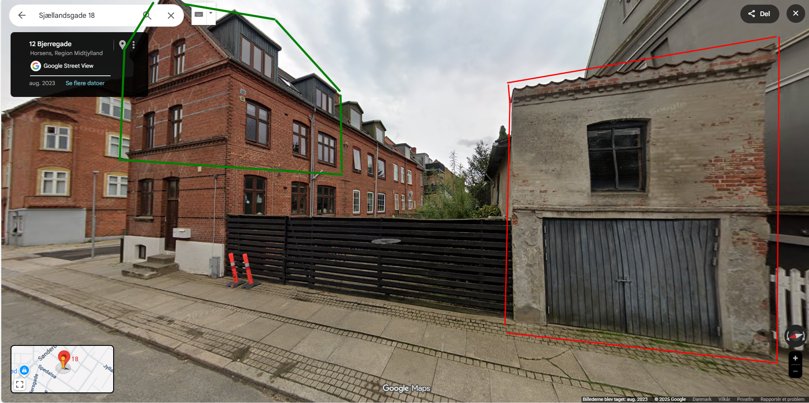
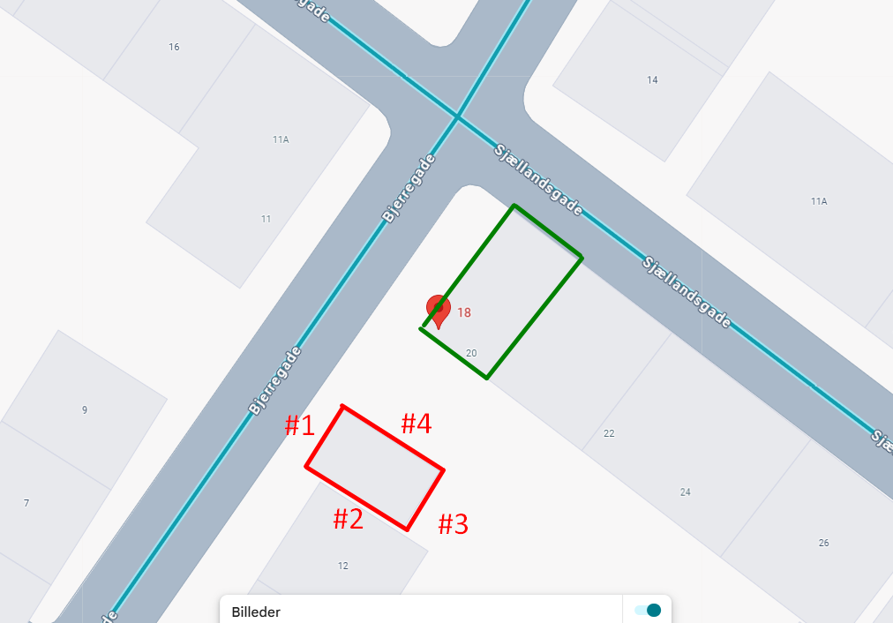
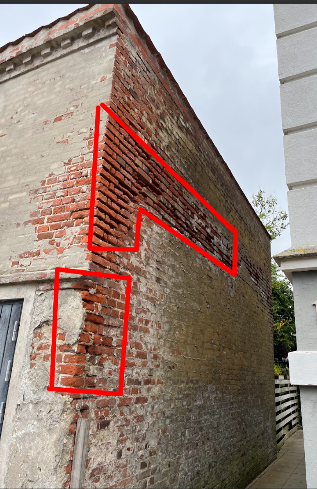
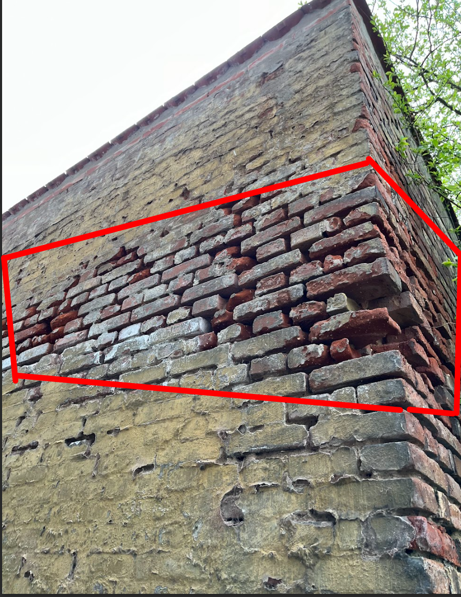
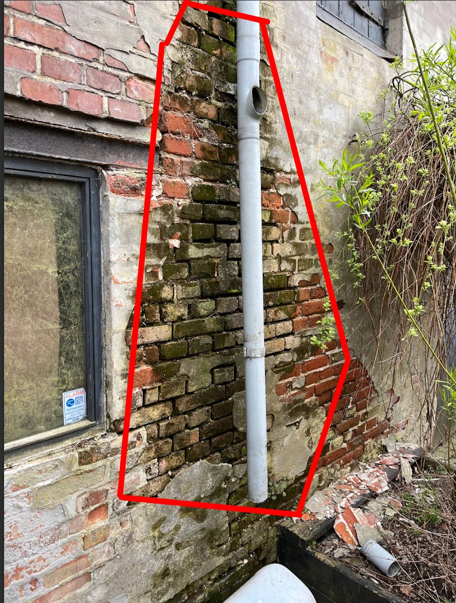

# 0. Reparation af murværk på skur
I dagene før 1. november vil vi gerne have repareret murværket på skuret. 

DET ER MEGET VIGTIGT AT VEJRET ER TØRT OG OVER 5 GRADER (OGSÅ OM NATTEN) - Derfor kan denne opgave måske blive nødt til at blive skudt.

Skuret er markeret i rødt nedenfor, mens lejligheden der skal renoveres er markeret i grøn. 

Set fra oven, er her skuret markeret i rødt igen og beboelsesejendommen markeret i grøn. Hver af siderne på muren er her defineret med #(1-4), og mur #1 er den man kan se fra vejen og første billede. 

### Dette skal laves
1. Løse mursten skal fæstnes
2. slidte / ødelagt mursten skal udskiftes
3. meget slidte fuger skal genetableres
4. algefjerner bruges på områder med alger efter fugerne er blevet renset.

### Områder af muren
Alle murene skal repareres hvor der mangler mørtel eller hvor murstenene er ødelagt. 
De værste områder er:
- #2

- hjørnet mellem #2 og #3 og #3

#3 er nok lidt besværligt at komme til pga. et hegn, men så må du gå ind fra den anden side.
- #4 burde se bedre mere tør ud end på dette billede
 

### Værktøj der skal bruges
1. mejsel
2. Murerske og fugejern [link](https://www.silvan.dk/produkt/kiesmo-murervaerktoejssaet-staal-3-dele-2640-2043220?gad_source=1&gad_campaignid=21374975911&gclid=Cj0KCQjwuKnGBhD5ARIsAD19Rsa9yzmRzRg8pU8JB2iVED9m9syxNTBZ0aGTb2W3FG5nar9Ct1S-r2gaArEAEALw_wcB)
3. stålbørste
4. murskehammer
5. murerspand
6. piskeris til blanding af mørtel
7. Skuremaskine til blanding af mørtel
8. vaterpas
9. kost 
10. vandforstøver
11. stige

### Materialer
1. kalkmørtel (færdigblandet tørmørtel - gerne vintermørtel)
2. mursten
3. vand
4. dækplast
5. Algefjerner (ph neutralt eller basisk! ikke syrebaseret - det ætser fuger og mursten)