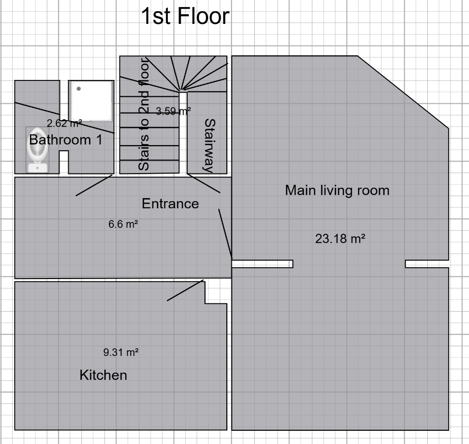
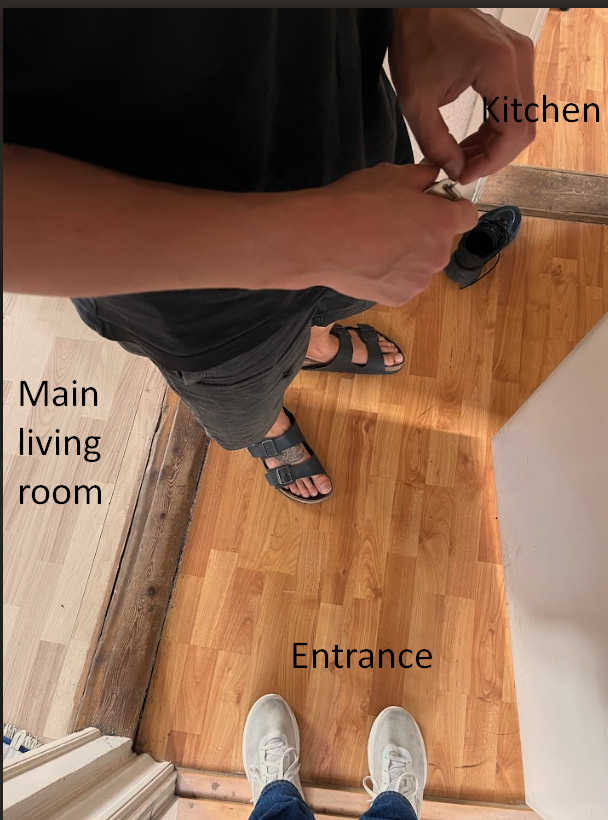

# 1. Nedrivning af gulv
I denne "work-package" består arbejdet i at fjerne gammelt gulv og fodlister.

  
  

### Gulv og fodlister der skal fjernes 
#### 1.1 Gulvtæppe og fodlister der skal fjernes 
- Room 3 (2nd floor)
- Room 2 (2nd floor)
- Room 1 (2nd floor)

#### 1.2 Vinyl gulv der skal fjernes og fodlister
- Stairway and hall (2nd floor)
- Room 4 (2nd floor)

Vi har ikke besluttet os for om vi vil fjerne vinylgulv fra badeværelse 2 endnu. Hvis det kan gøres rent og pænt vil vi gerne beholde det.
### Gulv der måske skal fjernes
#### 1.3 Laminatgulv 1st floor 
På 1st floor vil vi gerne have et nyt og ens gulv i både "Main living room", "Entrance" og "Kitchen".

  

<!-- Vi vil gerne have din vurdering af hvad der er nemmest?
A) Lægge nyt gulv ovenpå det gamle gulv
B) Fjerne gamle gulv og lægge nyt gulv

#### 1.3A)  Hvis ovenpå gamle gulv
Hvis nyt gulv lægges oven på det gamle kan det godt være at dørtrin mellem køkken og entre skal væk, således at gulvet fortsætter fra entre til køkken.

##### 1.3A.1) Fjern fodlister i
- Kitchen
- Main living room 
- Entrance

##### 1.3A.2) Fjern dørtrin
- Mellem Kitchen og Entrance -->

<!-- #### 1.3B) Hvis gamle gulv skal fjernes
##### 1.3B.1) Fjern fodlister i
- Kitchen
- Main living room 
- Entrance

##### 1.3B.1) Fjern gulv i
- Kitchen
- Main living room 
- Entrance -->

#### 1.3) Fjern laminat-trægulve
##### 1.3.1) Fjern fodlister i
- Kitchen
- Main living room 
- Entrance

##### 1.3.1) Fjern gulv i
- Kitchen
- Main living room 
- Entrance

### Værktøj 
Brækjern
hobby kniv
hammer
tang / rørtang
flad skruetrækker
stiksav

