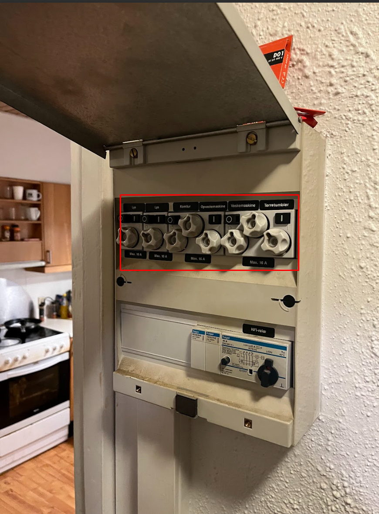

# 2. Demolition of Kitchen

I denne "work-package" består arbejdet i at rive Kitchen ned 

  
  

### Dette skal beholdes (!!)
Vi skal have adgang til vand når vi renoverer, og derfor skal vi beholde bordplade og vask efter opvaskemaskinen.

### Dette skal fjernes
1. Sluk og afbryd strøm 

2. Afbryd vand til opvaskemaskine og vandhane
3. Fjern opvaskemaskine og vær forsigtig ift. vand 
4. Fjern køleskab, ovn/komfur
5. Fjern overskabe
6. Vær forsigtig - afmonter emhætte
7. Skær bordpladen over ved opvaskemaskinen, 
8. Skru bordpladen løs og fjern den (behold del ved vask)
9.  Fjern underskabe og sokkel
10. fjern fliser 
11. Fjern konstruktion over overskabe, men behold rør til emhætte

### Værktøj der er brug for
brækjern / koben
Rørtang
svensknøgle
Papegøjetang
skruemaskine
hobbykniv
håndklæder og viskestykker
stiksav til at skære bordplade over hvis den er for tung
Papkasser til affald
Hammer 
majsel
borehammer med fladmejsel