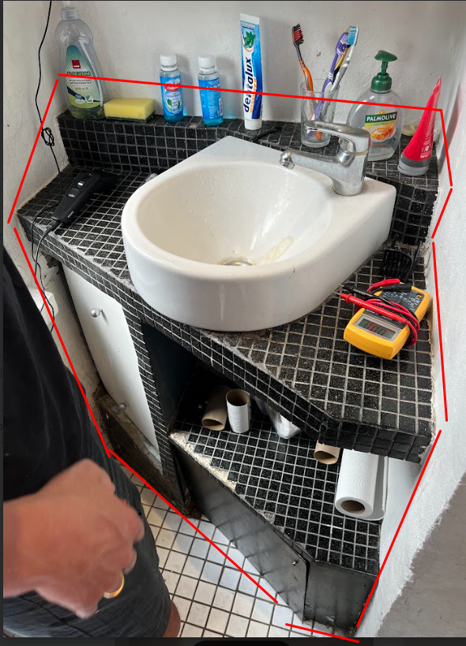
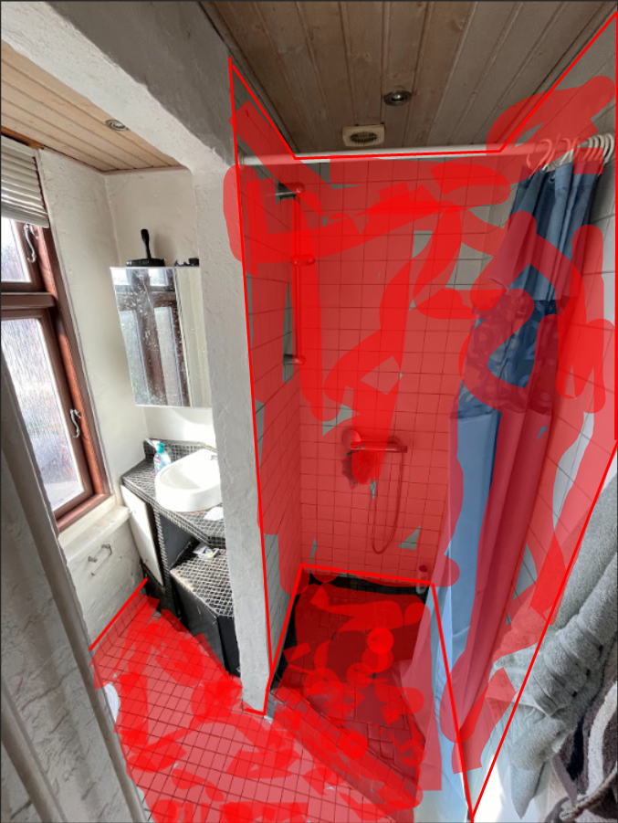

# 3. Nedrivning af Bathroom 1

I denne "work-package" består arbejdet i at rive Bathroom 1 ned. 

  
  

### Dette skal fjernes

#### Genstande der kan fjernes nemt
- toilet
- spejlskab
- persienner ved vindue

- bruserarmatur
- bruseforhæng
- fjern lister i kanten af loftet
- bruserstang
- toilet papir holder

#### Genstande der er sværere at fjerne
VIGTIGT: Der er vandrør under vasken, så vær forsigtig når det rives ned

- håndvask og hele konstruktionen rundt om 

.

#### Fliser 
- fliser på gulvet og bunden af vægge
- fliser på gulvet af brusenische (der skal etableres bedre fald i brusenichen, med eksisterende afløb!)
- filser på væggene af bruseniche

Vær forsigtig når fliserne omkring afløbet fjernes - vi vil gerne have samme afløb så vi undgår at skulle have lavet vvs arbejde.

### Værktøj der skal bruges
Hammer 
majsel
Brækjern
Hobbykniv
Skruemaskine med bits
Beskyttelsesbriller
Handsker
Borerhammer med flisemejsel
støvsuger
murerbalje
murerske
