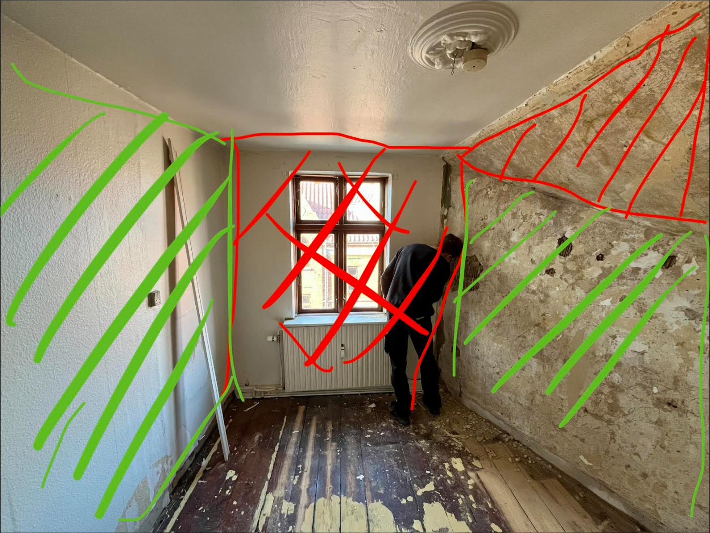
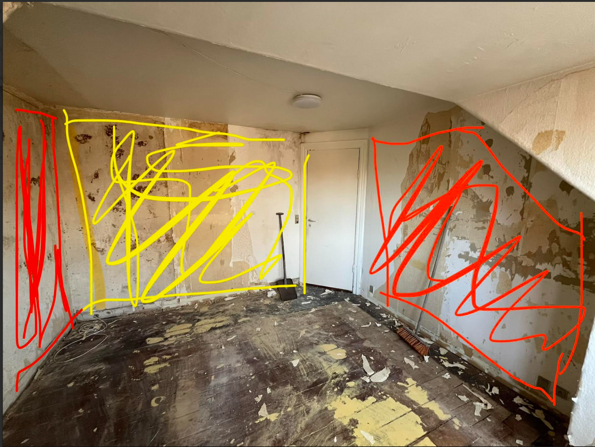
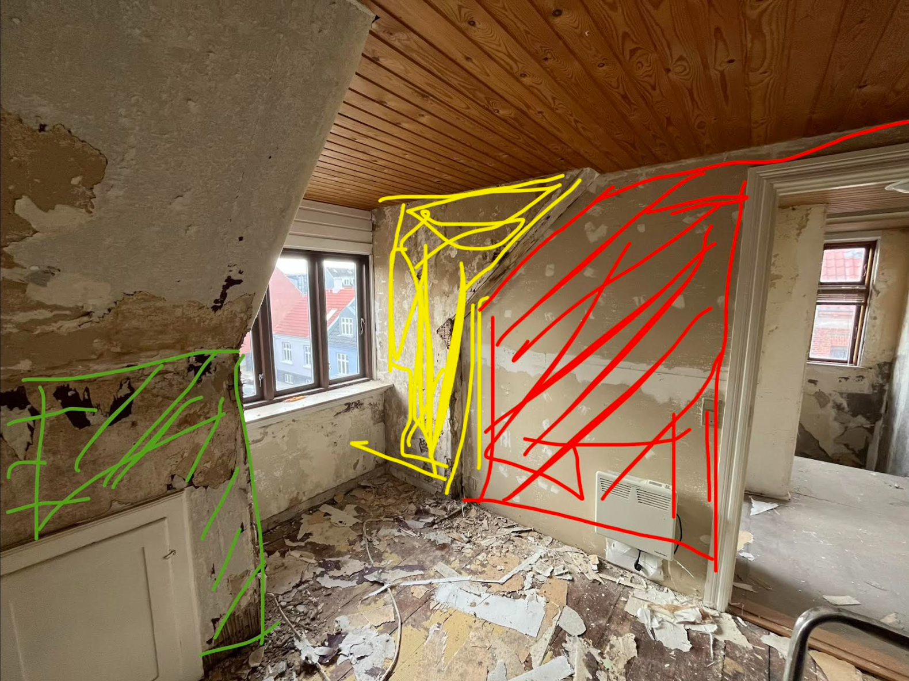

# Fix constructions of walls with knauf rotband and plasterboard

I denne "work-package" består arbejdet i at reparere vægge med Knauf Rotband og gipsplader efter der er blevet fjernet tapet. Vi deler det op i rum.

  
  

## VIGTIGT: Start med Knauf Rotband
De vægge der skal gips puds på (knauf rotband) skal behandles først, da rotband tørrer meget langsomt - 7-14 dage.

>Note: Fjern tapet før der grundes og pudses med Knauf Rotband.

#### Farver
gipsplader = grøn
Knauf Rotband = gul
Spartel = rød

> Vent med selve spartel arbejde til opgaven "Plaster all Walls"

#### Forklaring på hvilke vægge der får hvilken belægning.

- På vægge hvor den bagvedliggende konstktion er gipsplader eller træ plader, fastgør gipsplader
- På nogle vægge med meget løst puds, monter også gipsplader.
- På vægge hvor der er meget store ujævnheder, spartel op med Knauf rotband. Det kan vække op til 5 cm dybe huller.
- På vægge hvor puds er bedre intakt, fjern tapetrester så det er klart til at blive spartlet i "Plaster all Walls"
  

### Room 1

### Room 2

### Room 3

