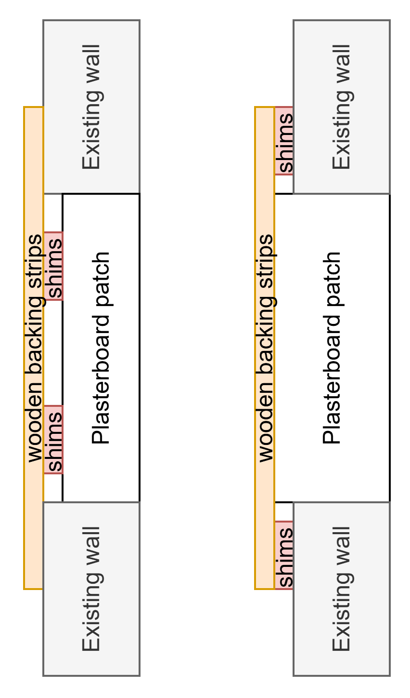

# 8. Fix wall construction in room 2

I denne "work-package" består arbejdet i at reparere et hul i en væg på Room 2. 

  
  

I rum 2 på 2nd floor, er der et hul i en væg konstruktion. Denne skal udbedres.

  
  

### Dette skal fjernes
1. Fjern løst / ustabil / beskadiget vægmateriale
2. Skær et firkantet stykke rundt om hullet ud (med stiksav)

### Dette skal opbygges
3. Skær en gipsplade i præcis samme størrelse som hullet
4. skær 2-3 forskallingsbrædder til så de er 10-15 cm længere end hullets brdde / højde og kan få fat på lægter bagved væggen.

5. Undersøg i hvilket niveau (med justeringsklodser) forskallingsbrædderne skal monteres. Målet er at gips-lappen skal flugte med den eksisterende væg, så spartle arbejdet bliver så let som muligt. Nedenfor er sketchet to muligheder hvor at væggen er tykkere end gipspladen eller hvor gipspladen er tykkere end væggen

  

6. Monter forskallingsbrædderne i det rette niveau med justeringsklodser, gennem væggen med træskruer så de kan agere støttelister for gips-lappen til at fylde hullet ud med.
7. Monter gipspladen i hullet på støttelisterne(forskallingsbrædder) med gipspladeskruer 
8. Påfør armeringstape i samlingerne

### Værktøj der er brug for
hobbykniv
stiksav
skruemaskine
bit sæt

### Materialer der skal bruges
Forskallingsbrædder ca 2 m af 20 x 40 mm, fx [link](https://www.10-4.dk/varer/byggematerialer/trae/forskalling/21x45mm-hovlet-forskalling-1147025050?child_product_id=339365)
Gipspladeskruer ca 3,5 × 35 mm.
træskruer 4 × 40 mm
armeringstape
justeringsklodser [link](https://www.jemogfix.dk/knudsen-kilen-styreklodser-50-stk/5140/9031746/)