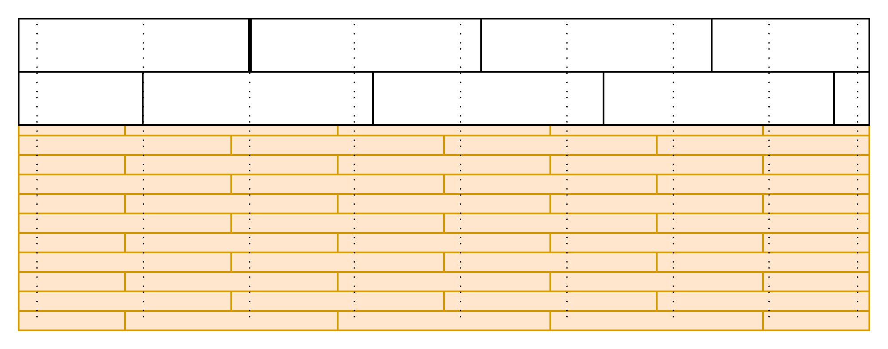

# 10b. Setup plasterboards in ceilings

I denne "work-package" består arbejdet i at sætte gipsplader op i loftet på en række rum. 

De følgende rum skal have gipsplader i loftene

1. Entrance
2. Kitchen
3. Bathroom 1
4. Stairway and hall (quite high, quite difficult. Maybe painting this is better.)
5. Room 3
6. Room 4 
7. Bathroom 2

  
  

#### Hul i loft til strøm
1. I alle rummene hænger der ledninger ned fra loftet. Der skal laves et hul i gipspladerne ved dette hul med 68 mm kopbor.

#### Hul i loft til udsugning (Bathroom 1, bathroom 2)

I bathroom 1 er der en udsugning. Der hvor udsugning sidder skal der være et hul i gipspladen på 100 mm boret med kopbor.

i bathroom 2 er der et udsugningshul, der skal også være et hul i gipspalde på 100 mm.

#### Room 4
dette rum har skråvægge som er beklædt med træ, og der skal også monteres gips på disse vægge (markeret med grønt). Dog ikke indensiden af loftsvindue (blå), da det vil blokkere for vinduet med gips. I stedet skal der her spartles direkte på træet, men det er ikke i denne beskrivelse at dette skal udføres.

### Opsætning af gipsplader
1. Undersøg loftet: Kig efter søm/skruer i det nuværende loft, som markerer hvor der ligger strøer eller lægter. Det er dér, du kan skrue gipspladerne fast.
2. placer streglaser (eller tegn streg med kridt / blyant ) så den flugter med søm i træloftet, så det er tydeligt hvor du skal skrue gipspladerne fast i lægter/spær
3. Monter gipspladerne på tværs af spærrene, hver stribe forskudt ift. hinanden (a la mursten). Pladerne skal monteres med gipsskruer
4. Placer gipspladerne på gipshejs og start fra hjørne. 
   1. Gipspladerne skrues fast med gipsskruer i 20-25 cm afstand mellem skruer. 
   2. Skruehoveder skal ligge lige under overfladen
   3. Forsøg at sørge for at pladekanterne rammer midt på en lægte, så næste plade kan starte samme sted og dele lægte.
   4. hvis loftet er meget skævt, kan det være nødvendigt at det op med justeringsklodser/kiler på lægterne inden det sættes op

### Værktøj der er brug for
Giraf
Hobbykniv
skruemaskine
kopbor 68 mm
kopbor 100 mm
streglaser / kridt / blyant
spand

### Materialer der skal bruges
afdækningsplast
malertape
grundrens
gipsplader 12.5 mm
Gipsskruer 35 mm
armeringstape
justeringsklodser

