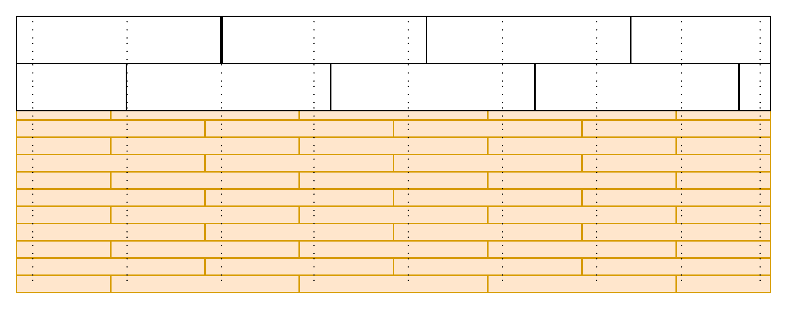

# 9. Sæt gipslofter op

I denne "work-package" består arbejdet i at sætte gipsplader op i loftet på en række rum. 

De følgende rum skal have gipsplader i loftene

1. Entrance
2. Kitchen
3. Bathroom 1
4. Stairway and hall (quite high, quite difficult. Maybe painting this is better.)
5. Room 3
6. Room 4 (lets see if doable)
7. Bathroom 2

  
  

#### Hul i loft til strøm
1. I alle rummene hænger der ledninger ned fra loftet. Der skal laves et hul i gipspladerne ved dette hul med 68 mm kopbor.

#### Hul i loft til udsugning (Bathroom 1)

I bathroom 1 er der en udsugning. Der hvor udsugning sidder skal der være et hul i gipspladen på 100 mm boret med kopbor.

### Opsætning af gipsplader
1. Undersøg loftet: Kig efter søm/skruer i det nuværende loft, som markerer hvor der ligger strøer eller lægter. Det er dér, du kan skrue gipspladerne fast.
2. placer streglaser (eller tegn streg med kridt / blyant ) så den flugter med søm i træloftet, så det er tydeligt hvor du skal skrue gipspladerne fast i lægter/spær
3. Monter gipspladerne på tværs af spærrene, hver stribe forskudt ift. hinanden (a la mursten). Pladerne skal monteres med gipsskruer
4. Placer gipspladerne på gipshejs / giraf og start fra hjørne. 
   1. Gipspladerne skrues fast med gipsskruer i 20-25 cm afstand mellem skruer. 
   2. Skruehoveder skal ligge lige under overfladen
   3. Forsøg at sørge for at pladekanterne rammer midt på en lægte, så næste plade kan starte samme sted og dele lægte.
   4. hvis loftet er meget skævt, kan det være nødvendigt at det op med justeringskodser på lægerne inden det sættes op

### Værktøj der er brug for
Giraf
Hobbykniv
skruemaskine
kopbor 68 mm
kopbor 100 mm
streglaser / kridt / blyant
spand
bløde børster der passer på teleskopstang (KUN MÅSKE)
svampe til teleskopstang (KUN MÅSKE)
teleskopstang
slibeklods der kan sidde på teleskopstang
sandpapir til slibeklods på teleskopstang (korn 120-150)
klud til teleskopstang (KUN MÅSKE)
mellemlang rulle (10-12 mm mnikrofiber)
pensel
malerbakke

### Materialer der skal bruges
afdækningsplast
malertape
spærrende grunder
grundrens

gipsplader 12.5 mm
Gipsskruer 35 mm
armeringstape
justeringsklodser
