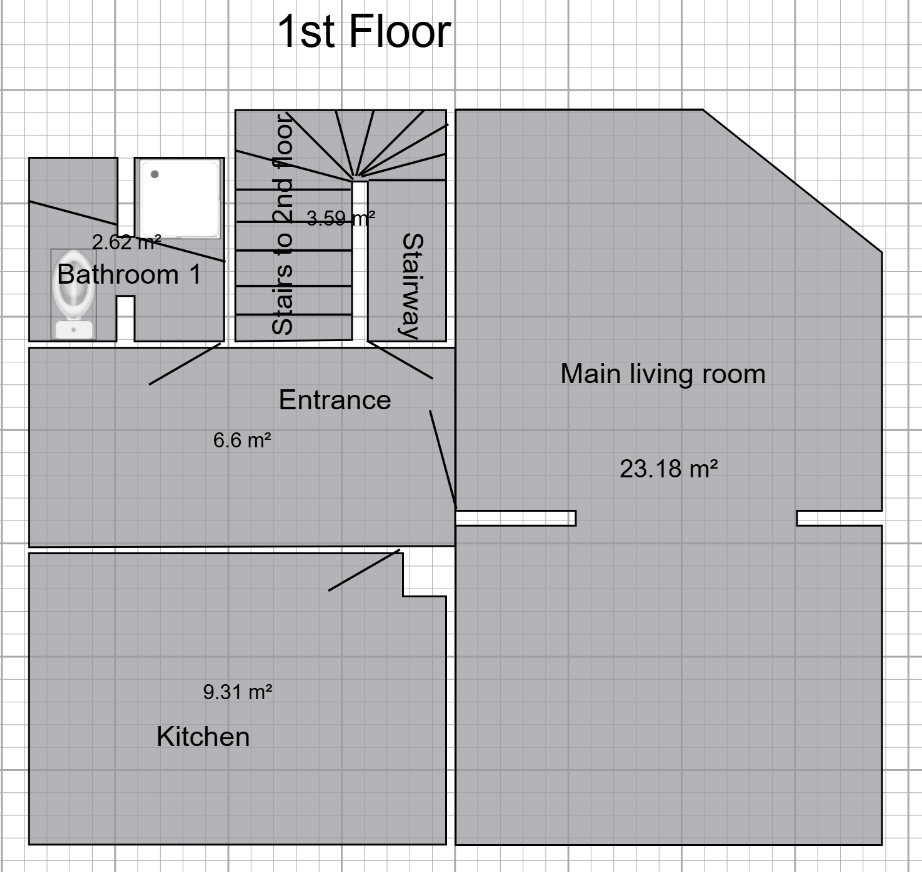
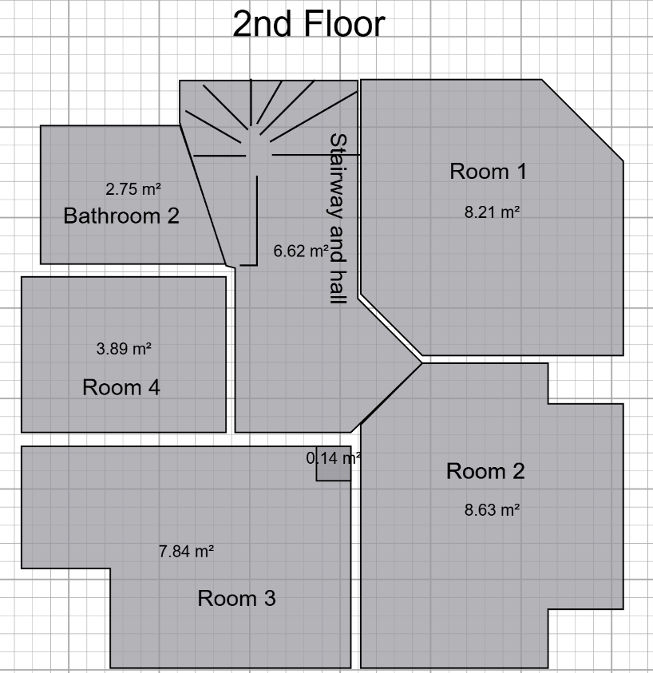

# x. Template

I denne "work-package" består arbejdet i at gøre lofter glatte med spartel.

  
  

### Disse rum skal have spartlet lofter
Alle rum med gipslofter 
- entrance
- kitchen
- bathroom 1
- room 3
- room 4
- bathroom 2
- stairway and hall

Rum med semi glatte lofter
- room 1 
- room 2

#### room 4: specielt
Vi ønsker at der også bliver spartlet direkte på træ i vindues parti - dette er beskrevet i 12c.

### Spartling af lofter uden gipsplader
Gør hvad du kan for at få lofterne i room 1 og 2 til at blive glatte.

### Spartling af lofter med gipsplader

**Første lag**
1. påfør selvklæbende armeringstape til alle samlinger 
2. Glat efter med et tyndt lag letspartel over tapen.
   
Lad tørre i 12-24 timer

**Andet lag**
1. slib let med korn 120–150 for at fjerne kanter.
2. Påfør et bredere lag spartel over samlingerne (ca. 25-30 cm)
3. Sørg for, at du får en jævn overgang mellem spartel og plade.

Lad tørre i 12-24 timer

**Trejde lag (finspartling)**
1. slib let med korn 120–150 for at fjerne kanter.
2. Påfør et tyndt finlag, kun hvor nødvendigt (f.eks. små ujævnheder og skruehuller).
3. Brug bred spartel (40–50 cm) for at trække det helt ud.

Lad tørre i 12-24 timer

**Slibning**

Formål: Jævn og glat overflade før maling.

1. Slib hele loftet med korn 180–220.

Børst eller støvsug efter.

### Værktøj der er brug for
bred spartel (40-50 cm)
smal spartel (20-30 cm)
støvsuger

### Materialer der skal bruges
letspartel
armeringstape (glasfiber-tape)
sandpapir korn 120-150
støvsugerposer