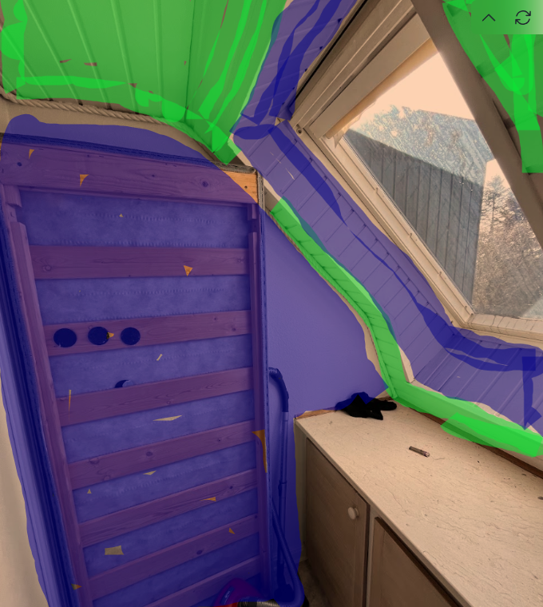

# 12. Prime walls and ceilings

I denne "work-package" består arbejdet i at grunde med forankrings grunder på vægge inden der kan spartles ovenpå.

  
  

### Disse rum skal grundes
1. Bathroom 1
2. Entrance
3. Kitchen
4. Stairway / hall
5. Room 1
6. Room 2
7. Room 3 (glasvæv)
8. room 4 (bådevindues ramme som blev vasket og vertikale vægge - se billede, blå skal grundes, grønt ikke)

### Påfør forankrings grunder 
#### Vægge
1. Rør grunderen godt op med rørepind
2. Start med at grunde med pensel 
   1. i hjørner, 
   2. langs lister
   3. bag radiatorer
   4. rundt om stikkontakter og lignende.

3. På **strukturpuds** / **rå pudset mur** - påfør grunder med den langhårede rulle på de store overflader
4. På vægge hvor **savsmuldstapet** er blevet fjernet - påfør grunder med mikrofiberrulle
5. På **glasvæv** (room 3) - påfør grunder med mellemlang mikrofiberrulle

### Materialer der skal bruges
Forankringsgrunder

### Værktøj der skal bruges
Malerbakke
Engangshandsker
Rulle med forlængerskaft
langhåret mikrofiberrulle 16-20 mm (til grove vægge - strukturmaling og mursten)
mellemlang rulle (10-14 mm mikrofiber)
Pensel
Rørepind

