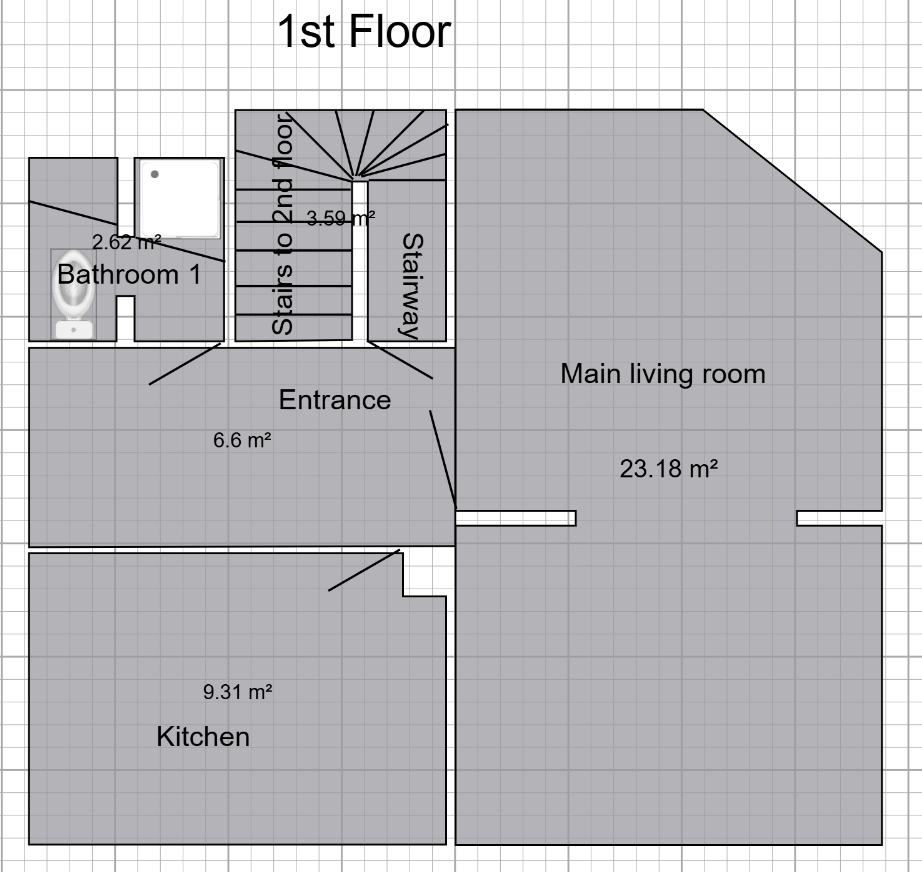
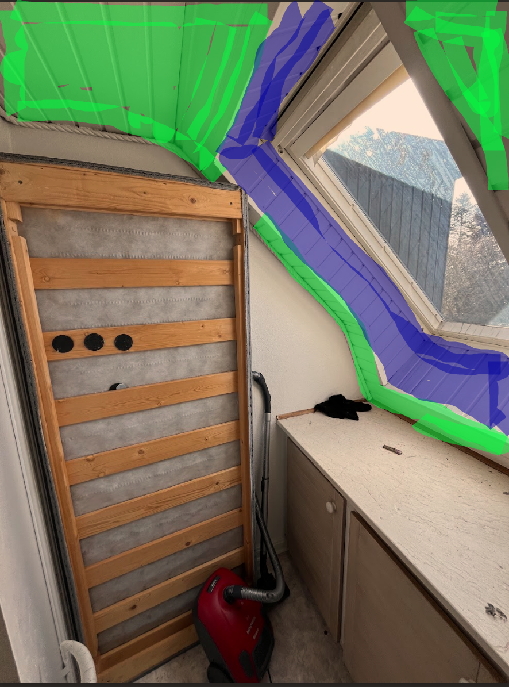

# 12c. Plaster all walls

I denne "work-package" består arbejdet i at gøre vægge glatte med gipspuds (rotband) og spartel.

Der er rum med forskellige slags overflader:
- fjernet tapet vægge
  -  kitchen (ikke bag temporary sink), Main Living room,  room 1, room 2, room 3, room 4 (vertikale vægge, ikke træloft/trævægge)
- strukturpuds
  - Entrance, stairway and hall
- rå pudset væg
  - bathroom 1
- træloft
  - vinduesramme i room 4
- Glasvæv (eksisterende stærk coating)
  - room 3

hvis rækkefølgen af dokumenterne og arbejdsprocessen har været korrekt, så er der allerede blevet grundet med forankrings grunder på alle væggene.

  
  

### Alupofiler hjørner mellem rum
Inden spartle arbejdet begynder på væggene skal hjørnerne inddækkes med aluprofiler for at give dem styrke. Dette skal altså gøres for alle rum hvor der spartles og er kanter. 
 

**Hjørner**
1. Påfør et jævnt lag medium spartelmasse langs hjørnet på begge sider.
2. Tryk aluprofilen direkte ind i den våde spartelmasse, så massen trænger ud gennem hullerne i profilen.
3. Justér profilen med vaterpas, så hjørnet bliver helt lodret.
4. Træk overskydende spartel af med bred spartel, så der er jævnt på begge sider.
5. Lad tørre fuldt ud, før du fortsætter med den øvrige spartling af væggene.

### Spartle gamle tapetvægge.
kitchen, room 1, room 2, main living room

Hvis disse vægge er meget beskadigede, så kan det være nødvendigt at bruge rotband (gipspuds) som første lag.
> **Note**: I rum 2, er der en skadet væg. Skaden skal pudses op med gipspuds før der kan spartles

I kitchen er der en midlertidig vask fra det gamle køkken. Det er ikke nødvendigt at spartle bag dette, men gerne til højre for. 

**Forarbejde / udligning**
1. Hvis overfladen er grov, udjævn med grovspartel.
2. Spartl revner og samlinger.
3. Lad tørre og slib let (korn 150).

**Afslutning: Fuldspartling med mediumspartel 1-2 lag**
1. Fuldspartel med mediumspartel.
2. Slib (korn 180–220), så væggen føles glat som gips.

### Spartle strukturpuds vægge
entrance, stairway

Forsøg at slibe de værste ujævnheder med giraf sliber. 

**Første lag: Grovspartel**

1. Påfør grovspartel med bred spartel. Arbejds i små felter af gangen.
2. træk diagonalt hen over strukturen med bred spartel for at presse spartel ned i dalene på strukturpuds.
3. lad tørre 12-24 timer.

**Andet lag (mediumspartel)**

Gentag med nyt lag.

Træk nu mere vandret/lodret for at udjævne fladen.

Lad tørre, slib med korn 150.

**Sidste lag - mediumpartling**
Hvis du vurderer at væggene er glatte nok, kan dette trin undværes.

1. Påfør et tyndt tredje lag.
2. Brug bred spartel og træk lange strøg.
3. Tørretid: 12–24 timer.
4. Slib med korn 180–220

### Spartle fast puds vægge
Bathroom 1 (ikke i brusekabine)

Væggene er generelt faste og egner sig til spartel direkte. 
Anvend kun gipspuds (Rotband) lokalt på beskadigede områder, hvor pudsen er løs eller ujævn – fx ved toiletrulleholderen.
Herefter spartles væggene som beskrevet ovenfor (medium spartel).

Bag ved rør på badeværelset ønskes en så plan og glat overflade som muligt, selvom arbejdet kan være udfordrende. Udfør efter bedste evne.

### spartle vinduesramme room 4
I Room 4 skal de skrå væg- og loftflader omkring vinduet gøres glatte, se billede for neden, markeret i blå.  
Der spartles direkte på eksisterende fast træoverfalde (ikke gips), efter rengøring og grunding med forankringsgrunder.

1. Sørg for, at overfladen er tør og grundet med forankringsgrunder.
2. Påfør første lag mediumspartel for at udjævne ujævnheder.
3. Lad tørre og slib (korn 120–150).
4. Påfør et eller to yderligere lag efter behov.
5. Slib med korn 180–220 og fjern støv.
6. Overfladen grundes efterfølgende med spærrende grunder som beskrevet i den senere work-package.

### Spartling af vægge med glasvæv
room 3

Vægge med glasvæv i room 3 skal spartles for at opnå en glattere overflade, men vævet fjernes ikke.

**Fremgangsmåde**
1. Kontroller at vævet er rent, tørt og fastsiddende.
2. Fuldspartl væggene med medium på bred spartel.
3. Træk diagonalt hen over strukturen for at fylde ujævnhederne ud.
4. Lad tørre 12–24 timer og slib med korn 150.
5. Påfør et tyndt lag mediumspartel for glat finish.
6. Slib let (korn 180–220) og kontroller at strukturen ikke længere er synlig.

### Værktøj der er brug for
bred spartel (35-45 cm)
teleskopstang
vaterpas
malerbakke

### Materialer der skal bruges
medium spartel
gipspuds (rotband)
grov spartel
sandpapir 150
sandpapir 220
aluprofiler til hjørner

