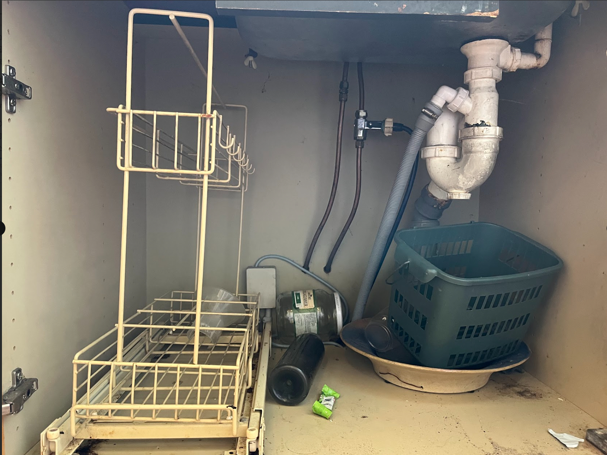

### 23. Remove temporary sink 

**Forudsætning**
- Hovedhane kan lukkes, og du kender placering.
- Der er **ingen** afspærringsventiler på varmt/koldt (kobberrør direkte op til armatur - se billede nedenfor).
- Mål størrelse på kobber rør, for at finde de helt rigtige fittings.

#### Trin

1. **Klargør**
   - Tøm skabet. Læg håndklæder/spand klar.

2. **Luk vandet i hele boligen**
   - Luk **hovedhanen**.
   - Åbn en hane i lejligheden (laveste punkt) for at aflaste tryk → luk igen (bathroom 1, I guess. Alternativt i kælderen).

3. **Afløb**
   - Skru vandlåsen (P-fælde) fra og tøm i spand.
   - Sæt **testprop/blindprop** i afløbsrøret (Ø32/40), så der ikke lugter.

4. **Frakobl armaturet**
   - Løsn **kompressionssamlingerne** på de to kobberrør under vasken (messingmøtrikkerne).
   - Træk rørene fri af armatur/tilslutning. Forvent lidt restvand.

5. **Midlertidig sikring af vandrør**
   - **MÅL rør-OD** (typisk **12 mm** eller **15 mm**) og brug fittings i **samme mm**.
   - Montér **kompressions-blindpropper** *eller* (bedre) **kompressions-afspærringsventiler** på **hver** af de to kobberrør — **med ny oliven/klemring** pr. samling.
   - Skub møtrik + **oliven** på røret → sæt fitting på → **spænd moderat med to nøgler**.
   - **Ingen PTFE-tape** på selve kompressionssamlingen (rør/oliven). Tape anvendes kun på **BSP-gevind**, hvis du senere skruer noget i ventilens udgang.
   - Åbn kort **hovedhanen** igen og **tjek tæthed** i 10–15 min. 0 dråber = ok. Luk igen før næste trin.

6. **Afmonter vasken**
   - Skær silikone langs kanter.
   - Løsn beslag/skruer under vasken.
   - Løft vask og armatur ud som en samlet enhed. Bortskaff eller midlertidigt oplag.

7. **Afslutning**
   - Lad blindpropper/ventiler blive siddende på kobberrørene til køkkenmontage.
   - Sørg for at **afløbsproppen** bliver siddende.
   - Ryd op og tør alt vand op.

---

---

### Materialer
- Kompressions-afspærringsventil **12 mm** eller **15mm** (2 stk) (mål i ejendom)
- **Oliven/klemringe 12 mm/15 mm** (ekstra)  (mål i ejendom)
- PTFE-tape  
- Afløbsprop Ø32  
- Afløbsprop Ø40  
- Skæresnor til silikone  
- Engangshandsker  
- Rengøringsklude  
- Affaldssæk

### Værktøj
- Skiftenøgle  
- Fastnøgle  
- Lille rørtang  
- Spand  
- Hobbykniv  
- Multicutter (valgfri)  
- Lygte  
- Støvsuger
