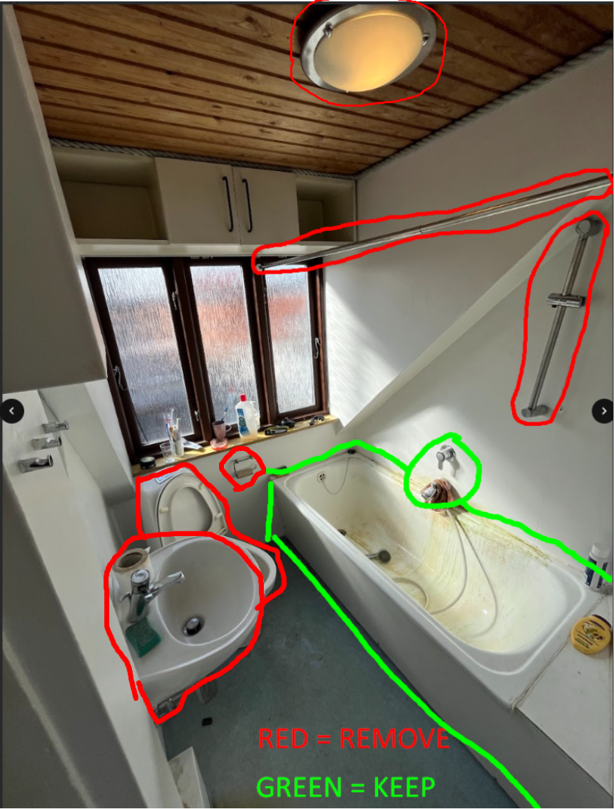
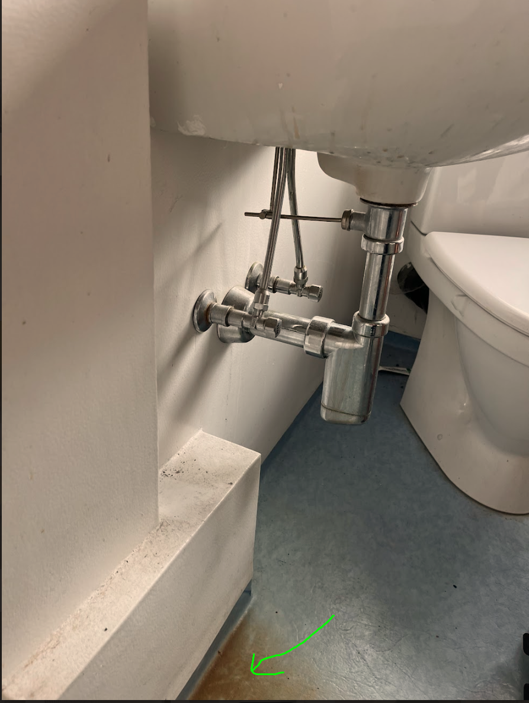

# 4. Demolition of bathroom 2.

I denne "work-package" består arbejdet i at rive Bathroom 2 ned. 

  
  

### Dette skal beholdes (!)
- Blandingsbatteri og hane ved bad
- Badekar
- hvis vinyl gulv kan renses under vask, skal det beholdes (!!!!)

#### Forsøg at fjerne plet under vask med oxalsyre

Der er en brun misfarvning under vasken, sandsynligvis fra rust i rør eller fittings (se billede)
 
Gulvet skal forsøges renset – hvis det bliver pænt, beholdes det. Hvis ikke, skiftes det senere.

**Fremgangsmåde:**
1. Bland oxalsyre med vand (ca. 1 del oxalsyre til 10 dele vand).  
2. Påfør med klud eller svamp – ikke direkte på gulvet.  
3. Lad virke 1–2 minutter, men hold øje med overfladen.  
4. Skrub let, og skyl derefter grundigt med rent vand.  
5. Tør efter med ren fugtig klud.  
6. Gentag hvis nødvendigt – må gerne prøves lidt mere intensivt her, da gulvet under alle omstændigheder skal vurderes for udskiftning.  

⚠️ **OBS:**  
- Brug handsker og sørg for udluftning.  
- Hvis overfladen bliver tydeligt misfarvet eller mat, stop forsøget.  
- Det vigtigste er at se, om farven kan fjernes uden at skade gulvet væsentligt.

### Dette skal fjernes
- toilet
- spejl
- vask
- stang til bruseforhæng
- bruserstang
- Slange og bruser hoved
- toilet papir holder
- reb lang med lofterne

### Dette skal sættes op: 
- nyt toilet, løst, men dog således at der er et toilet at bruge under renoveringsarbejdet.

### Værktøj der er brug for
Svensknøgle
Skruemaskine med bits
Rørtang
spand
klude
hobbykniv
Svamp
Spand  
Engangshandsker 

### Materialer der skal bruges
- Oxalsyre  
- Rent vand  
