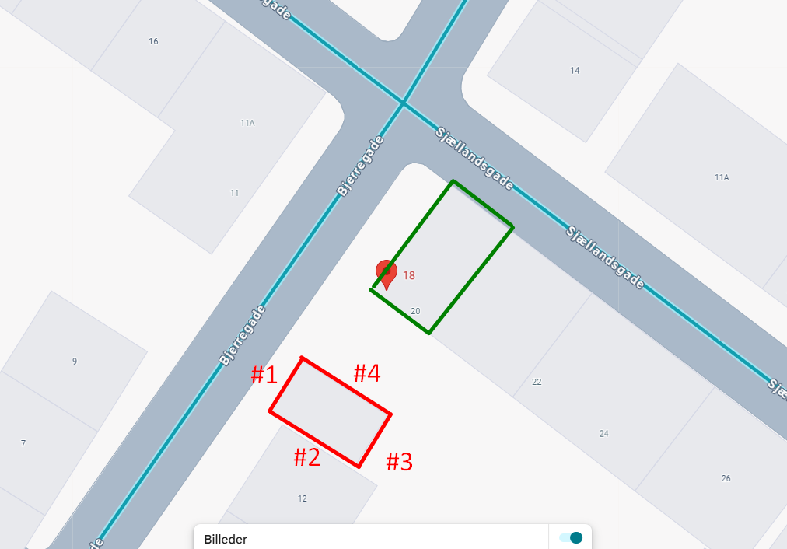
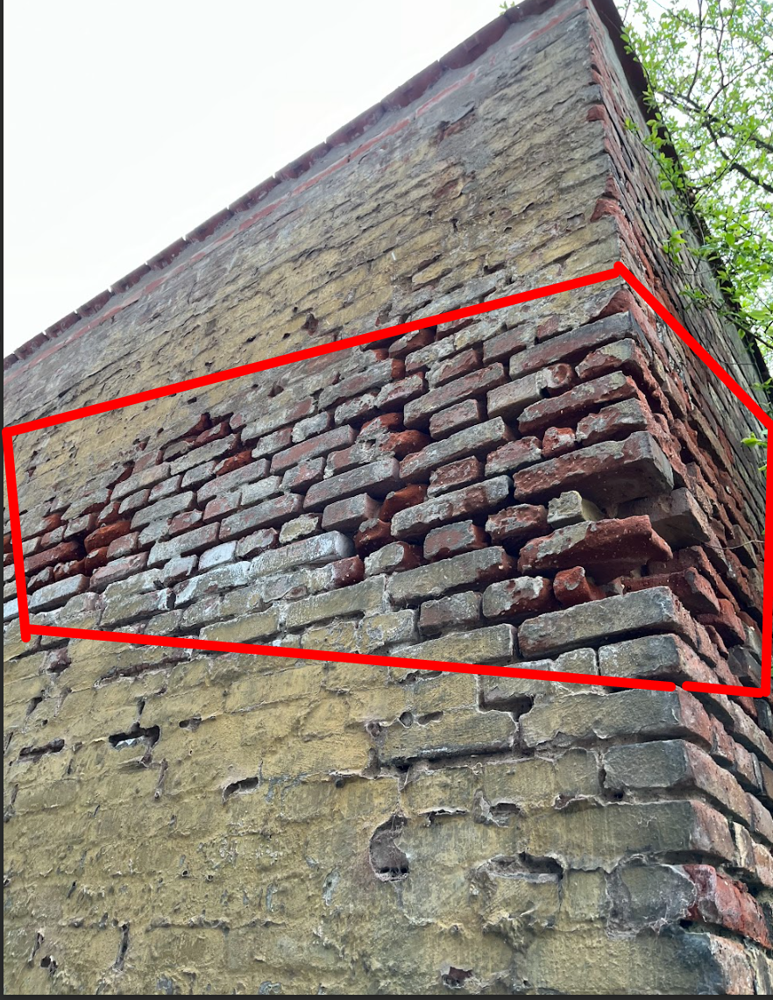
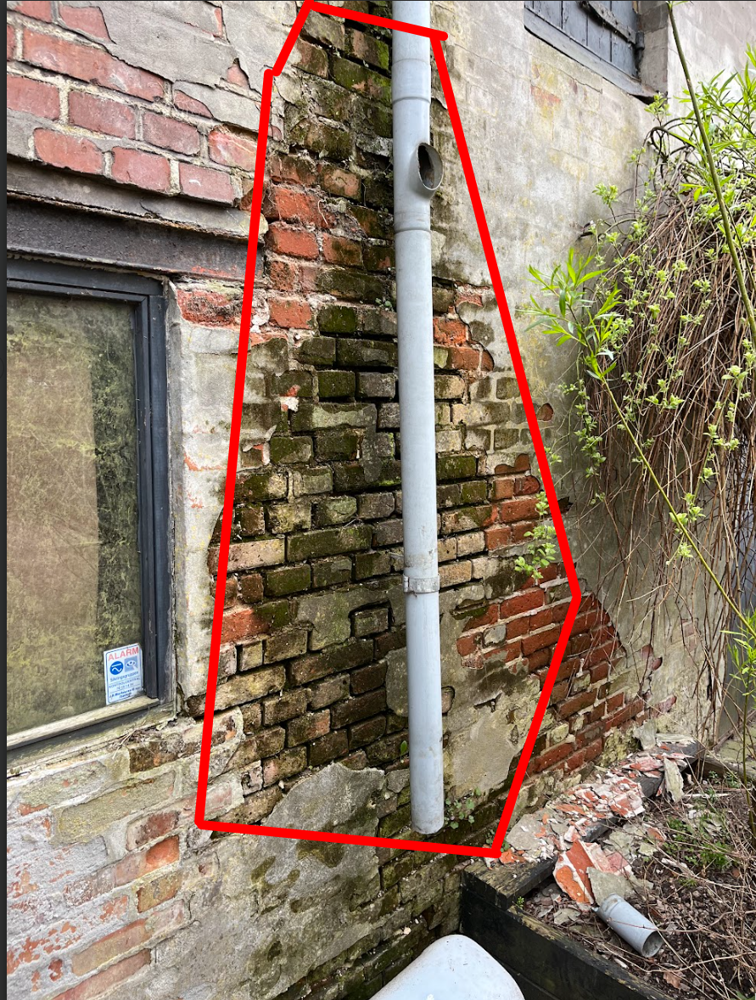

# Reparația zidăriei la șopron
În zilele dinaintea datei de 1 noiembrie dorim să reparăm zidăria șopronului.

ESTE FOARTE IMPORTANT CA VREMEA SĂ FIE USCATĂ ȘI PESTE 5°C (ȘI NOAPTEA) – de aceea această sarcină poate fi necesar să fie amânată.

Șopronul este marcat cu roșu mai jos, iar apartamentul care urmează să fie renovat este marcat cu verde.

Văzut de sus, șopronul este din nou marcat cu roșu, iar proprietatea rezidențială cu verde. Fiecare latură a peretelui este definită cu #(1–4), iar peretele #1 este cel vizibil din stradă și în prima imagine.  

### Ce trebuie făcut
1. Cărămizile slăbite trebuie fixate.
2. Cărămizile uzate / deteriorate trebuie înlocuite.
3. Rosturile foarte uzate trebuie refăcute.
4. Agentul de îndepărtare a algelor se folosește pe zonele cu alge după curățarea rosturilor.

### Zone ale peretelui
Toți pereții trebuie reparați acolo unde lipsește mortarul sau unde cărămizile sunt deteriorate.  
Zonele cele mai afectate sunt:
- #2  
  
- colțul dintre #2 și #3 și #3  
    
  #3 probabil este mai dificil de accesat din cauza unui gard; atunci intră din partea cealaltă.
- #4 ar trebui să pară mai uscat decât în această imagine  
  

### Unelte necesare
1. daltă
2. mistrie și fier de rostuit [link](https://www.silvan.dk/produkt/kiesmo-murervaerktoejssaet-staal-3-dele-2640-2043220?gad_source=1&gad_campaignid=21374975911&gclid=Cj0KCQjwuKnGBhD5ARIsAD19Rsa9yzmRzRg8pU8JB2iVED9m9syxNTBZ0aGTb2W3FG5nar9Ct1S-r2gaArEAEALw_wcB)
3. perie de sârmă
4. ciocan pentru zidărie
5. găleată de zidar
6. spirală/pale pentru amestecarea mortarului
7. mașină de amestecat mortarul
8. nivelă
9. mătură
10. pulverizator cu apă
11. scară

### Materiale
1. mortar de var (uscat, preamestecat – de preferat „mortar de iarnă”)
2. cărămizi
3. apă
4. folie de protecție
5. agent de îndepărtare a algelor (pH neutru sau bazic! nu acid – atacă rosturile și cărămizile)
