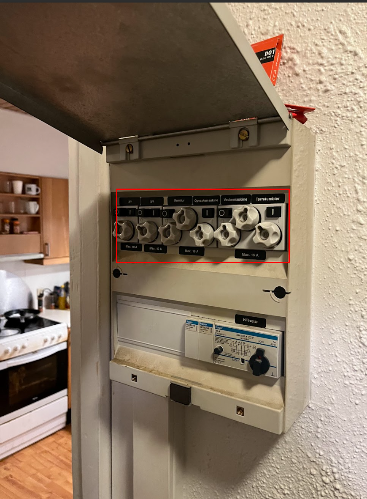

# Demolition of Kitchen

În acest „work-package” sarcina este demontarea Kitchen.

  
  

### Ce trebuie păstrat (!!)
Trebuie să avem acces la apă în timpul renovării, de aceea păstrăm blatul și chiuveta după mașina de spălat vase.

### De îndepărtat
1. Opriți și deconectați alimentarea electrică  
   
2. Opriți alimentarea cu apă către mașina de spălat vase și baterie
3. Demontați mașina de spălat vase și manevrați cu atenție din cauza apei
4. Demontați frigiderul, cuptorul/aragazul
5. Demontați dulapurile suspendate
6. Demontați hota cu atenție
7. Tăiați blatul la nivelul mașinii de spălat vase
8. Deșurubați și îndepărtați blatul (păstrați porțiunea de la chiuvetă)
9. Demontați dulapurile de bază și soclul
10. Îndepărtați plăcile
11. Demontați construcția de deasupra dulapurilor suspendate, păstrați tubulatura hotei

### Unelte necesare
rangă / levier  
cheie pentru țevi  
cheie reglabilă  
clește papagal  
mașină de înșurubat  
cutter  
prosoape și lavete  
ferăstrău pendular pentru a tăia blatul dacă e prea greu  
cutii de carton pentru deșeuri  
ciocan  
daltă  
ciocan rotopercutor cu daltă lată
