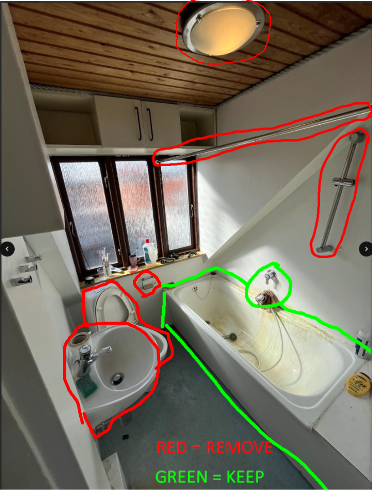

# Demolarea Bathroom 2

În acest „work-package” lucrarea constă în demontarea (demolarea) Bathroom 2.

  
  

### De păstrat (!)
- Bateria de amestec și robinetul de la cadă/duș
- Cada
- Pardoseala din vinil (**va fi vopsită ulterior**)

### Îndepărtarea calcarului din cadă
- Cumpărați decalcifiant și bureți
- Frecați cada până când toate depunerile de calcar sunt eliminate

### De demontat / îndepărtat
- Vasul de toaletă
- Oglinda
- Lavoarul
- Bara pentru perdeaua de duș
- Suportul pentru duș (bracket)
- Furtunul și para de duș
- Suportul pentru hârtie igienică
- **Cordonul** de-a lungul tavanului (dacă există)

### De montat
- Toaletă nouă, montată provizoriu, astfel încât să poată fi utilizată pe durata renovării.

### Unelte necesare
- Cheie suedeză (reglabilă)
- Mașină de înșurubat cu biți
- Cheie pentru țevi
- Găleată
- Cârpe
- Cutter/hobbykniv
- Burete
- Găleată (spand)
- Mănuși de unică folosință

### Materiale necesare
- Decalcifiant
- Burete de frecat
- Apă curată
