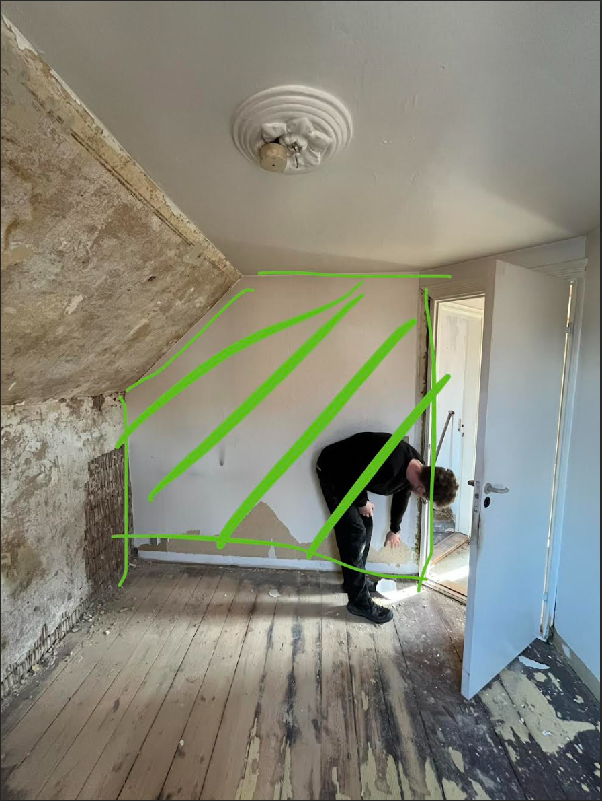
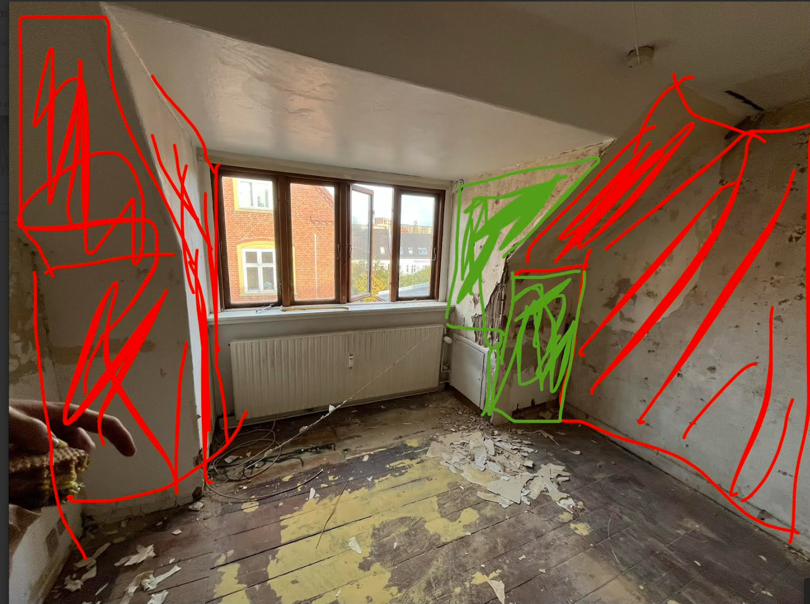
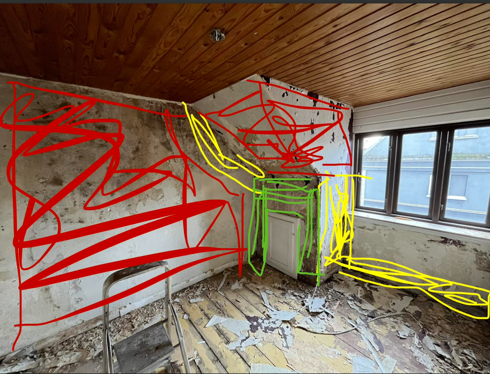

# Repararea pereților cu Knauf Rotband și plăci de gips-carton

În acest „work-package” lucrarea constă în repararea pereților cu Knauf Rotband și plăci de gips-carton după îndepărtarea tapetului. Împărțim pe camere.

  
  

## IMPORTANT: Începeți cu Knauf Rotband
Pereții care vor primi tencuială pe bază de gips (Knauf Rotband) trebuie tratați mai întâi, deoarece Rotband se usucă foarte lent – 7–14 zile.

> Notă: Îndepărtați tapetul înainte de grunduire și tencuire cu Knauf Rotband.

### Procedură cu Knauf Rotband (tencuială pe bază de gips)

#### Unelte
- Găleată de amestec, malaxor/palete
- Ploscă/stålbræt, gletieră de finisaj (35–45 cm)
- Dreptar/pudse-/featheredge (80–120 cm), gletieră pentru colțuri
- Burete abraziv/svamp, pensulă/spray
- Aspirator, materiale de protecție

#### Pregătire
1. Suport ferm, curat, fără praf (răzuiți părțile friabile).
2. **Suport absorbant**: grund de penetrare. **Suport dens/neted**: grund de aderență cu cuarț.
3. Umeziți ușor suprafețele foarte uscate chiar înainte de aplicare.

#### Amestecare
- Mai întâi apa → presărați pulberea → lăsați 2–3 min să se hidrateze → mixați până devine cremos.
- **Pentru găuri**: consistență ceva mai tare. **Pentru netezire**: cremos/întins.
- Faceți loturi mici; timp de lucru ~**20–30 min**. **Nu reamestecați** după ce începe să prindă.

---

#### A) Umpleri și reparații
1. Apăsați mortarul bine în adâncituri (straturi ≤ 2–3 cm pentru găuri adânci).
2. Trageți ușor **peste plan** cu dreptarul/gletiera (în direcții încrucișate).
3. Așteptați până devine mat/„fingerfast” (10–30 min).
4. **Burete umezit** în mișcări circulare → finisați cu gletiera curată în trageri lungi.
5. Corectați micile goluri cu un amestec proaspăt.

#### B) Netezirea pereților
1. **Strat 1**: Aplicați un strat generos. Trageți vertical/oblic în trageri lungi.
2. Reprofilare: umpleți zonele joase și trageți din nou.
3. Când devine mat/fingerfast: **buretați ușor** → glisați/finisați uniform.

---

#### Post-tratare
- **Șlefuiți ușor** (K180–220) numai unde este necesar.
- **Uscare**: uscare completă înainte de pașii următori (în funcție de grosime/climă) – 7–14 zile.
- **Grund**: grund de penetrare înainte de vopsire/glet fin.
- **Vopsea**: permeabilă la vapori.

#### Sfaturi & capcane
- Păstrați găleata/uneltele **perfect curate**.
- Lucrați **„ud pe ud”** pe suprafețe pe care le puteți finisa în același lot.
- Evitați curenții/aerotermele (risc de crăpături/margini arse).
- **Consum**: ~1 kg/m² per mm.
- Nu pentru zone direct umede fără sistem complet adecvat.

### Culori
plăci de gips-carton = verde  
Knauf Rotband = galben  
Glet/spartel = roșu

> Amânați gletul de finisaj până la sarcina „Plaster all Walls”.

### Explicație privind tratamentul pereților

- Pe pereții cu **structură de gips-carton sau plăci din lemn** în spate, fixați **plăci de gips-carton**.
- Pe unii pereți cu tencuială foarte slabă, montați de asemenea **plăci de gips-carton**.
- Pe pereții cu denivelări foarte mari, **nivelare cu Knauf Rotband**. Poate umple **până la ~5 cm** local.
- Pe pereții unde tencuiala este mai bine păstrată, îndepărtați resturile de tapet pentru a putea gletui în „Plaster all Walls”.

### Room 1

### Room 2
Peretele galben trebuie netezit, deoarece nu este plan. Asta înseamnă „**full-skim**” cu Knauf Rotband.

### Room 3

