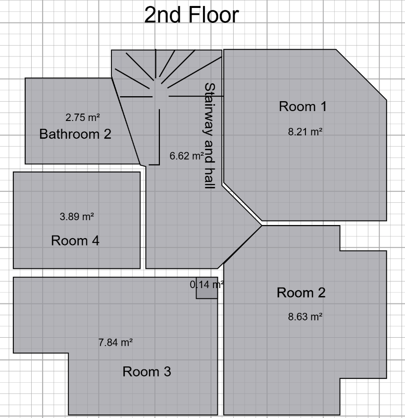

# Curățenie

În acest „work-package” sarcina este curățenia înaintea acoperirii grosiere.

  
  

### De curățat
În toate camerele,

1. Aspirați.
2. Ștergeți toate suprafețele cu o cârpă umedă.

### Unelte necesare
Aspirator  
Găleată de zidar pentru deșeuri  
Găleată

### Materiale necesare
Saci pentru aspirator  
Cârpă  
Detergent universal
