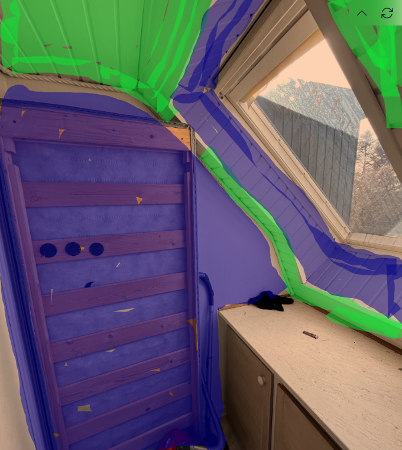

# Amorsarea tuturor pereților înainte de gletuire

În acest „work-package” sarcina este grunduirea cu amorsă de ancorare a pereților înainte de aplicarea gletului.

  
  

### Pereții din aceste camere trebuie amorsați
1. Bathroom 1
2. Entrance
3. Kitchen (ikke bag temporary sink)
4. Stairway / hall
5. Room 1
6. Room 2
7. Room 3 
8. Main living room
9. room 4 (atât rama ferestrei care a fost spălată, cât și pereții verticali – vezi imaginea; albastru = se amorsează, verde = nu)

> **NOTĂ, Room 4:** vezi imaginea; albastru = se amorsează, verde = nu.

### Aplicarea amorsei de ancorare
#### Pereți
1. Amestecați bine amorsa cu o spatulă/lemn de amestecat.
2. Începeți cu pensula:
   1. în colțuri,
   2. de-a lungul plintelor/listelor,
   3. în spatele radiatoarelor,
   4. în jurul prizelor și punctelor similare.
3. Pe **tencuială decorativă** / **zid tencuit brut** – aplicați amorsa cu rolă de microfibră cu păr lung pe suprafețele mari.
4. Pe pereții unde **tapetul de tip „woodchip”** a fost îndepărtat – aplicați amorsa cu rolă de microfibră (mărime medie).

### Materiale necesare
Amorsă de ancorare

### Unelte necesare
Tavă pentru vopsit  
Mănuși de unică folosință  
Rolă cu prelungitor  
Rulou de microfibră cu păr lung 16–20 mm (pentru pereți rugoși – tencuială structurată și zidărie)  
Rulou mediu (10–12 mm microfibră)  
Pensulă  
Spatulă/lemn de amestecat
