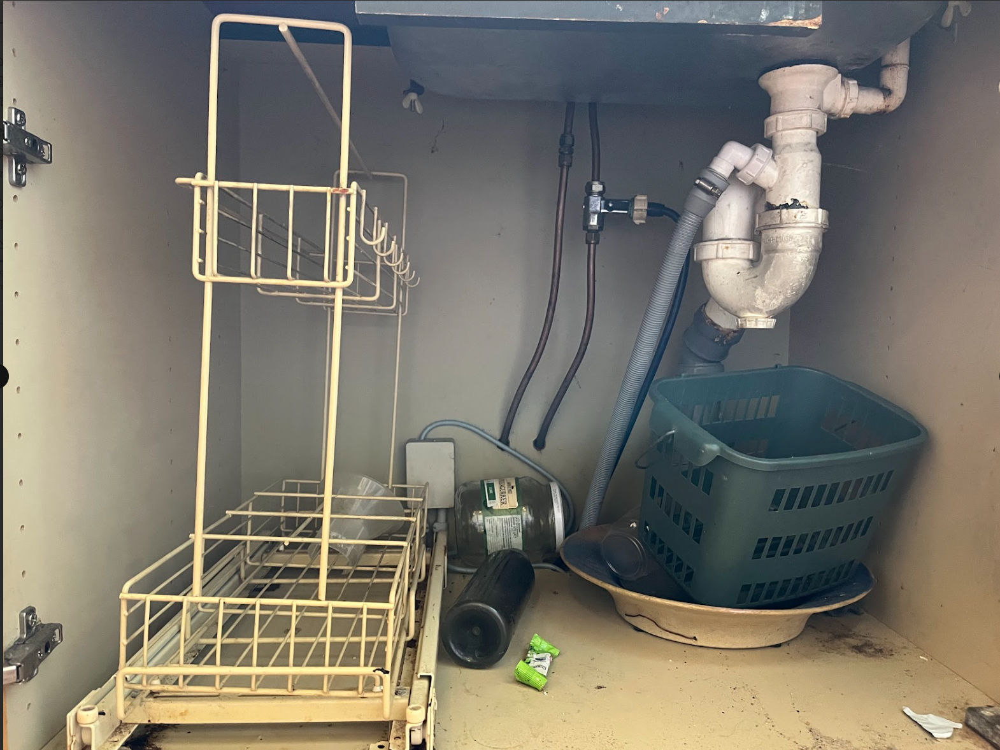

# Demontarea chiuvetei temporare

**Condiții prealabile**
- Poți închide robinetul principal de apă și știi unde se află.
- **Nu există** robinete de închidere pe apă caldă/rece (țevi de cupru direct în baterie – vezi imaginea de mai jos). – acestea se află, în schimb, în cutia de lângă Bathroom 1, în colțul din Entrance.
- Măsoară diametrul exterior al țevilor de cupru pentru a alege fitingurile corecte.

#### Pași

1. **Pregătire**
   - Golește dulapul. Pregătește prosoape/găleată.

2. **Închide alimentarea cu apă lângă Bathroom 1.**
   - Închide cele două valve care alimentează Kitchen – folosește șurubelnița.
   - Deschide un robinet în apartament (cel mai jos punct) pentru a depresuriza → apoi închide-l (probabil în Bathroom 1; alternativ în pivniță).

3. **Scurgere**
   - Desfă **sifonul (capcană P)** și golește în găleată.
   - Montează **dop de test/dop orb** în țeava de scurgere (Ø32/40), pentru a preveni mirosurile.

4. **Deconectează bateria**
   - Slăbește **racordurile de compresie** de pe cele două țevi de cupru de sub chiuvetă (piulițele din alamă).
   - Scoate țevile din baterie/racord. Așteaptă puțină apă reziduală.

5. **Asigurare temporară a țevilor de apă**
   - **MĂSOARĂ OD-ul țevii** (de obicei **12 mm** sau **15 mm**) și folosește fitinguri cu **aceeași dimensiune**.
   - Montează pe **fiecare** din cele două țevi de cupru **dopuri oarbe cu compresie** *sau* (mai bine) **valve de închidere cu compresie** — **cu inel nou (olive/inel de strângere)** la fiecare îmbinare.
   - Pune pe țeavă **piulița + inelul (olive)** → așază fittingul → **strânge moderat cu două chei**.
   - **Fără bandă PTFE** pe îmbinarea de compresie (țeavă/olive). Banda se folosește doar pe **filete BSP**, dacă ulterior înșurubezi ceva în ieșirea valvei.
   - Deschide scurt **robinetul principal**, **verifică etanșeitatea** 10–15 min. 0 picături = ok. Închide din nou înainte de pasul următor.

6. **Demontarea chiuvetei**
   - Taie siliconul de pe margini.
   - Slăbește clemele/șuruburile de sub chiuvetă.
   - Ridică chiuveta și bateria ca ansamblu. Elimină sau depozitează temporar.

7. **Finalizare**
   - Lasă dopurile/valvele montate pe țevile de cupru până la montajul bucătăriei.
   - Asigură-te că **dopul de scurgere** rămâne montat.
   - Fă curățenie și șterge toată apa.

---

---

### Materiale
- **Valvă de închidere cu compresie** **12 mm** sau **15 mm** (2 buc) (măsurare la fața locului)
- **Inele (olive) 12 mm / 15 mm** (de rezervă)  (măsurare la fața locului)
- Bandă PTFE  
- Dop scurgere Ø32  
- Dop scurgere Ø40  
- Sfoară pentru tăierea siliconului  
- Mănuși de unică folosință  
- Cârpe de curățare  
- Sac menajer

### Unelte
- Cheie reglabilă  
- Cheie fixă  
- Cheie mică pentru țevi  
- Găleată  
- Cutter/hobby knife  
- Multicutter (opțional)  
- Lanternă  
- Aspirator
